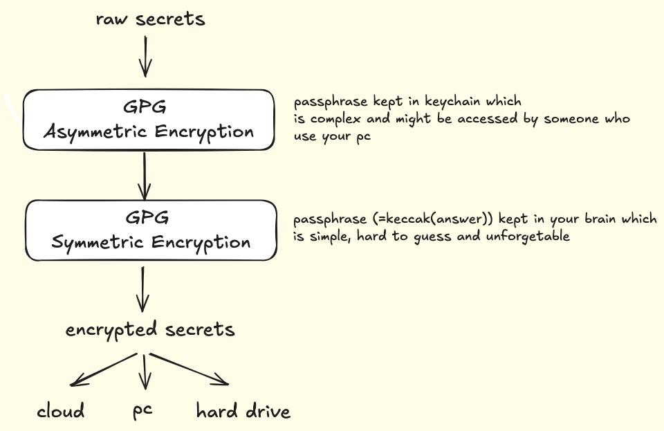

# What is safesecrets

Safesecrets is a desktop application for securely storing and managing sensitive information like passwords, mnemonics, and other credentials. Built with Tauri and React, it provides:

- Strong encryption for your secrets
- Local storage - your data never leaves your device
- Simple and intuitive interface
- Open source and auditable code

## Demo Video

[](https://www.youtube.com/watch?v=Xd-GzsMoS3A)

*Click the image above to watch the demo video on YouTube*

# How is your data encrypted



# Install

```bash
git clone git@github.com:hejtao/safesecrets.git
cd safesecrets
yarn install
yarn tauri:build
```
